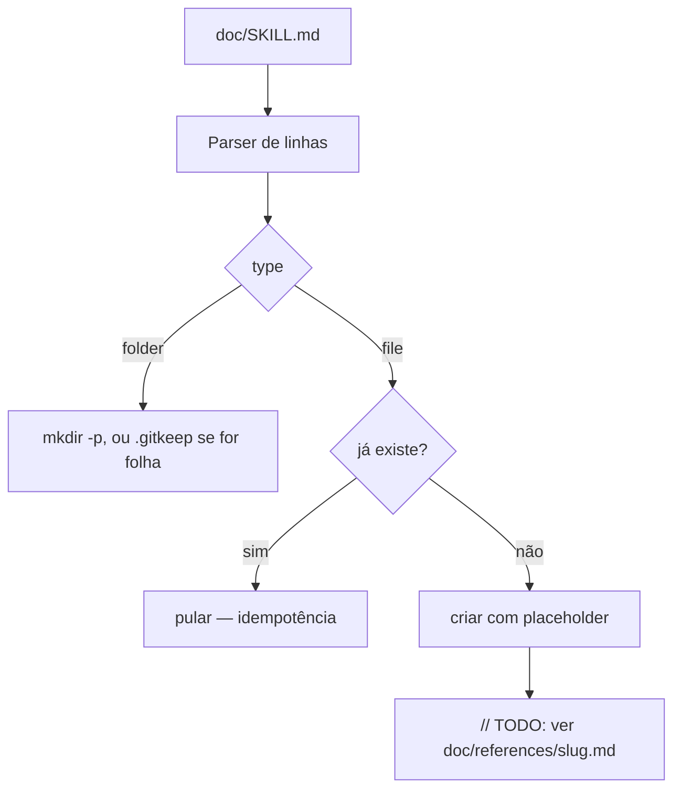

`promptdown-ui-v3/.specs/features/repo-scaffolding/design.md` é o design da feature de scaffolding — e também serve como exemplo didático de como a **Knowledge Verification Chain** do skill `tlc-spec-driven` funciona na prática, incluindo quando parar de pesquisar.

---

# Scaffolding do Repositório — Design

**Spec**: `.specs/features/repo-scaffolding/spec.md`
**Status**: Draft

---

## Pesquisa (Knowledge Verification Chain)

Antes de desenhar a arquitetura, o skill exige seguir esta cadeia em ordem estrita, sem pular para o fim:

```
Passo 1: Codebase       → checar código/convenções já existentes
Passo 2: Docs do projeto → README, docs/, .specs/codebase/
Passo 3: Context7 MCP   → resolver biblioteca, consultar API atual
Passo 4: Busca web      → docs oficiais, fontes confiáveis
Passo 5: Marcar como incerto → só se 1-4 não resolveram
```

**Como isso se aplica aqui — e por que paramos no Passo 2:**

- **Passo 1 (Codebase)**: não há código real ainda (`promptdown-ui-v3` não foi implementado — ver memória de projeto). Não há padrão de código para checar.
- **Passo 2 (Docs do projeto)**: aqui a cadeia **já resolve tudo**. `doc/SKILL.md` + os ~90 `doc/references/*.md` já documentam, literalmente, cada arquivo/pasta que precisa existir e por quê. Não é uma decisão de design nova — é dado já disponível.
- **Passos 3 e 4 (Context7/busca web)**: **não acionados**. A regra do skill é "boas razões para pesquisar: bibliotecas novas, APIs desconhecidas, features sensíveis a performance/segurança, padrões nunca usados neste código" — nenhuma dessas se aplica: criar pastas e arquivos vazios não é uma API nova nem um padrão desconhecido.
- **Passo 5 (incerteza)**: não há nada incerto a marcar — a única coisa "nova" é o próprio script gerador, que é simples o suficiente para não precisar de pesquisa externa (usa só `node:fs`, sem dependência).

**Lição geral**: a cadeia existe para evitar pular direto para "buscar no Google" ou, peor, inventar uma API. Quando o Passo 2 já responde tudo com confiança, parar ali é o comportamento **correto** — pesquisar além disso seria desperdício, não rigor.

---

## Architecture Overview

Um único script gerador lê `doc/SKILL.md` (a mesma fonte de verdade já usada por `exemple.html` e por `scripts/regenerate-skill-md.mjs` neste repositório de estudos) e, para cada linha, garante que o path correspondente exista no repositório de destino — como pasta vazia (`folder`) ou arquivo com um comentário placeholder (`file`).



---

## Code Reuse Analysis

### Existing Components to Leverage

| Component | Location (neste repo `doc`) | How to Use |
|---|---|---|
| Regex de parsing de linha do SKILL.md | `exemple.html`, função `parseSkillIndex` (`LINE_RE`) | Reutilizar a mesma regex para extrair `path`/`type`/`slug`/`summary` de cada linha — já testada e em produção neste repositório |
| Lógica de montagem de árvore | `exemple.html`, função `buildTree` | Mesmo princípio (inferir hierarquia pelos segmentos do `path`) pode orientar a ordem de criação (pastas antes dos arquivos-filho) |
| `scripts/slug.mjs` (`slugify`) | `scripts/slug.mjs` | Não é necessário para o scaffold em si (os slugs já estão escritos no `SKILL.md`), mas é o mesmo utilitário que gerou esses slugs — útil se uma feature futura adicionar novos itens à árvore real |

### Integration Points

| Sistema | Método de integração |
|---|---|
| `doc/SKILL.md` (este repositório) | Lido via `fs.readFileSync`, nunca via fetch HTTP — o scaffold roda localmente (Node.js), não no navegador |
| Repositório de destino (`promptdown-ui-v3`, ainda não criado) | Recebe os paths criados via `fs.mkdirSync`/`fs.writeFileSync`, relativo a um diretório-raiz passado como argumento do script |

---

## Components

### `scaffold-from-skill.mjs` (script gerador)

- **Purpose**: Ler `doc/SKILL.md` e criar, no repositório de destino, todo path documentado que ainda não existe.
- **Location**: `scripts/scaffold-from-skill.mjs` (no repositório novo, não em `doc/`)
- **Interfaces**:
  - `parseSkillLines(markdown: string): Entry[]` — mesma regex de `exemple.html`, retorna `{ path, type, slug, summary }[]`.
  - `scaffold(entries: Entry[], destRoot: string): ScaffoldReport` — cria pastas/arquivos faltantes; retorna relatório (criados, pulados, avisos).
- **Dependencies**: só `node:fs` e `node:path` — sem dependência externa.
- **Reuses**: a regex `LINE_RE` de `parseSkillIndex` em `exemple.html` (ver Code Reuse Analysis).

### Estratégia de placeholder por tipo de arquivo

- **Purpose**: decidir o conteúdo inicial de cada arquivo criado, sem inventar lógica.
- **Location**: dentro do próprio `scaffold-from-skill.mjs`.
- **Interfaces**: `placeholderFor(path: string, slug: string): string` — escolhe o comentário certo pela extensão (`//` para `.js`, `#` para `.sh`/`.yml`, `<!-- -->` para `.html`, vazio para `.json`).
- **Dependencies**: tabela de extensão → estilo de comentário.
- **Reuses**: nenhum — é a única peça genuinamente nova desta feature.

---

## Data Models

Não aplicável — esta feature não introduz nenhum modelo de dados; ela só cria estrutura de arquivos vazios.

---

## Error Handling Strategy

| Cenário de erro | Tratamento | Impacto para o usuário |
|---|---|---|
| Linha do `SKILL.md` não casa com o padrão esperado | Ignorar a linha, registrar aviso no relatório final | Scaffold continua; usuário vê quantas linhas foram ignoradas |
| Arquivo de destino já existe | Pular sem sobrescrever (idempotência — requisito SCAFFOLD-02) | Nenhum — comportamento esperado ao rodar de novo |
| Pasta sem nenhum arquivo-filho documentado | Criar a pasta + `.gitkeep` | Pasta aparece rastreável no git |
| Path com colisão de case em FS case-insensitive (Windows) | Detectar e listar no relatório como aviso, sem falhar | Usuário decide manualmente como resolver |

---

## Tech Decisions (only non-obvious ones)

- **Por que reaproveitar a regex de `exemple.html` em vez de re-parsear o Markdown com uma lib genérica**: a regex já é estrita o suficiente (exige o formato exato `- \`path\` (folder|file) → \`doc/references/slug.md\` — summary`) e já está validada em produção neste repositório — usar uma lib de Markdown genérica adicionaria uma dependência só para reler um formato que já tem um parser funcionando.
- **Por que não popular `database.json` com dados de exemplo aqui**: populamos só a estrutura (`{"prompts": []}`), porque dados de exemplo são uma decisão de produto (quantos? quais campos preenchidos?), não uma decisão de scaffolding — fica explicitamente fora de escopo (ver spec.md).

## Fontes

- `doc/SKILL.md`, `exemple.html` (`parseSkillIndex`, `buildTree`), `scripts/slug.mjs` — todos já existentes neste repositório
- Template de design: skill `tlc-spec-driven`, `references/design.md`
